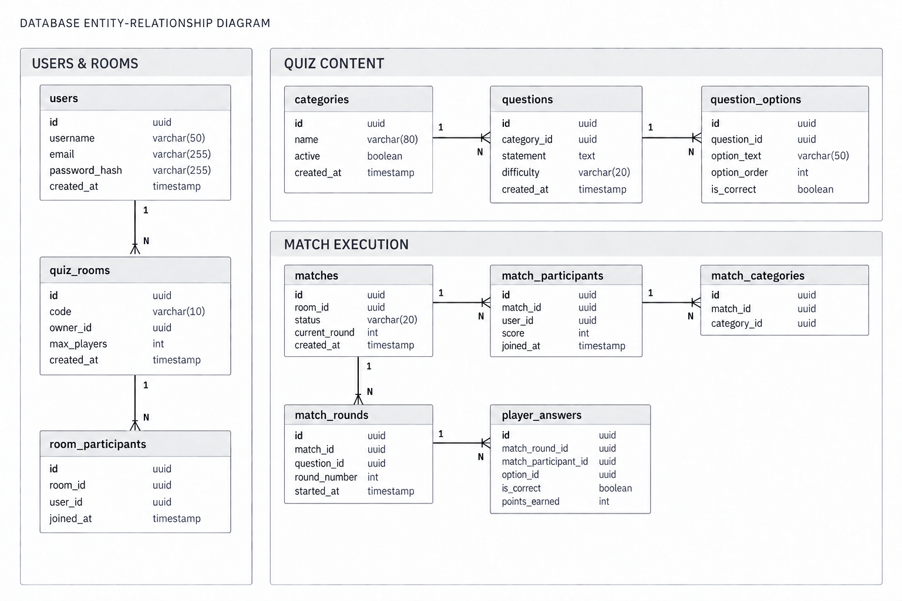

# Crazy Noisy Quiz

Crazy Noisy Quiz é uma arena multiplayer de quizzes criada para partidas entre amigos. Os jogadores podem criar salas privadas, escolher categorias e competir em partidas sequenciais, respondendo perguntas em tempo real.

O projeto foi criado com foco em aprendizado e portfólio, explorando desenvolvimento mobile nativo, desenvolvimento de APIs, persistência de dados e comunicação em tempo real.

## Visão geral

O sistema será composto por:

- Aplicativo Android nativo.
- Backend REST desenvolvido com Spring Boot.
- Partidas multiplayer com comunicação em tempo real.
- Salas privadas acessadas por código.
- Perguntas organizadas por categorias.
- Pontuação baseada em acerto e velocidade de resposta.
- Histórico de partidas e evolução futura para rankings e temporadas.

## Arquitetura do banco de dados



O modelo está dividido em três áreas principais:

- Usuários e salas.
- Conteúdo dos quizzes.
- Execução das partidas.

## Tecnologias planejadas

### Backend

- Java 21.
- Spring Boot.
- Spring Web.
- Spring Data JPA.
- Spring Security.
- PostgreSQL.
- Flyway.
- WebSocket.
- Lombok.
- Testcontainers.

### Mobile

- Kotlin.
- Jetpack Compose.
- Arquitetura MVVM.
- Coroutines e Flow.
- Retrofit.
- Room, quando necessário.

## Escopo inicial

- Cadastro e login.
- Criação de salas privadas.
- Entrada por código.
- Até oito jogadores por sala.
- Seleção de categorias.
- Dez perguntas por partida.
- Partidas sequenciais na mesma sala.
- Pontuação por acerto e velocidade.
- Resultado final da partida.
- Histórico de partidas.
- Comunicação em tempo real via WebSocket.

## Estrutura do projeto

```text
docs/       Documentação, regras e diagramas
backend/    API Spring Boot
mobile/     Aplicativo Android, a ser criado
```

## Documentação

- [Visão do produto](docs/product-overview.md)
- [Escopo do MVP](docs/mvp-scope.md)
- [Regras de negócio](docs/business-rules.md)
- [Modelo de domínio](docs/domain-model.md)
- [Backend](backend/README.md)

## Status

O projeto está na etapa inicial de estruturação do backend e definição da arquitetura. A implementação será desenvolvida incrementalmente, começando pela API e pelo modelo de persistência.
